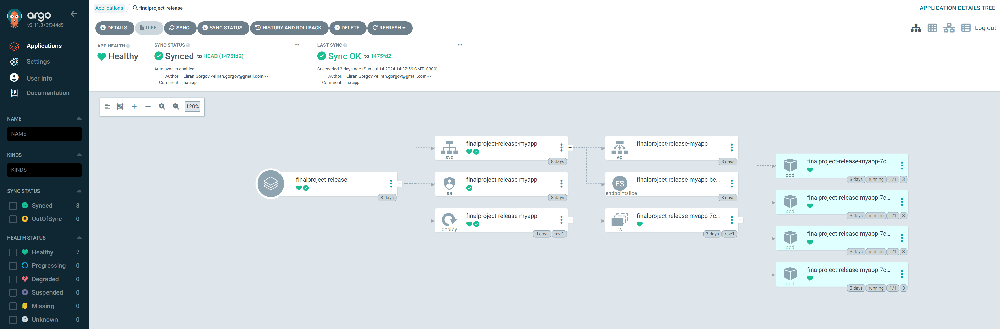

# CRUD (Create, Read, Update, and Delete) Application Deployment Pipeline

## Overview

This README provides an overview of an end-to-end CI/CD pipeline for deploying a Flask application connected to MongoDB in a Kubernetes environment. The pipeline leverages Jenkins for continuous integration, Docker for containerization, Helm for package management, and Argo CD for GitOps-based continuous deployment.

**Technologies Used:**
- **Kubernetes**: Container orchestration platform.
- **Docker**: Containerization technology.
- **Flask**: Python web framework.
- **MongoDB**: NoSQL database.
- **Jenkins**: Automation server for continuous integration.
- **Argo CD**: Declarative GitOps continuous delivery tool.

## Prerequisites

Ensure you have a functional application and have followed the setup instructions in the previous README to verify your application locally.

## Structure and Essential Files
```bash
├── Dockerfile                        # Instructions for building the Docker image of the application.
├── Dockerfile.test                   # Instructions for building a Docker image specifically for testing.
├── Jenkinsfile                       # Defines the Jenkins pipeline for CI/CD processes.
├── README.md                         # Markdown file providing an overview and documentation of the project.
├── app.py                            # The main Python application file.
├── application-ArgoCD.yaml           # Configuration for deploying the application with Argo CD.
├── build-pod.yaml                    # Kubernetes configuration for a build pod of the Jenkins agent.
├── count-rule.yml                    # Configuration for custom rules for metrics or alerts.
├── docker-compose.yaml               # Docker Compose file to set up and run multi-container Docker applications.
├── myapp                             # Directory for Helm chart and Kubernetes deployment files.
│   ├── Chart.yaml                    # A YAML file containing information about the Helm chart.
│   ├── charts                        # Directory for additional Helm charts that this chart depends on.
│   ├── templates                     # Template files that generate Kubernetes manifests.
│   │   ├── NOTES.txt                 # Notes on using the chart.
│   │   ├── _helpers.tpl              # Helper template functions used in the Helm chart.
│   │   ├── deployment.yaml           # Kubernetes Deployment resource template.
│   │   ├── hpa.yaml                  # Kubernetes Horizontal Pod Autoscaler resource template.
│   │   ├── ingress.yaml              # Kubernetes Ingress resource template.
│   │   ├── service.yaml              # Kubernetes Service resource template.
│   │   ├── serviceaccount.yaml       # Kubernetes ServiceAccount resource template.
│   │   └── tests                     # Directory for test templates.
│   │       └── test-connection.yaml  # Kubernetes test template to verify connectivity.
│   └── values.yaml                   # Default configuration values for the Helm chart.
├── requirements.txt                  # List of Python packages required for the application.
├── static                            # Directory for static files like CSS.
│   └── style.css                     # CSS file for styling the web application.
├── templates                         # Directory for HTML template files.
│   └── index.html                    # Main HTML template for the web application.
├── test_app.py                       # Python file containing tests for the application.
```

## Jenkins Agent Configuration

This build-pod.yml file defines a Kubernetes Pod named `jenkins-agent` with three containers (ez-docker-helm-build, python-test, and docker-compose), where the docker-compose container mounts the Docker socket from the host for Docker operations, facilitating a Jenkins agent environment that can build Docker images, run Python, and use Docker Compose.


## Continues Integration with Jenkins 

### 1. Pipeline Configuration

- Select the Multi-Branch Pipeline in Jenkins.

- Enter the credentials in the pipeline settings using a token from GitLab and copy the repository URL.

- The configuration will follow the Jenkinsfile and check this file every minute for any changes.

### 2. API Token

- Create a new secret token for API requests from GitLab.

### 3. Jenkinsfile Configuration

- Create a Jenkinsfile with the following settings:

- Agent definition

- Environment variables (repository link and account link)

- Pipeline stages

- Unitest the application

At the end of the pipeline, there is an included step to create a new branch with changes from the main branch and create a merge request that merges the changes from the new branch into the main branch.
For the merge, approve the request from GitLab.

## Build the Docker Image and Pushing it to DockerHub

Build command:
```bash 
docker build -t elirang/flask-finalproject:latest .
```

Push Command:
```bash
docker push elirang/flask-finalproject:latest
```

In order to access DockerHub via Jenkins, we need to create a token access key in DockerHub and fill in the credentials in Jenkins.

## Create a Helm Chart for the Application

### 1. Initialize Helm Chart
 Use helm create to generate a new chart template for your application, which will include Kubernetes deployment, service, and ingress resources. (in our exemple the name of the chart is `myapp`) make sure you in the correct folder before doing this command:

```bash 
helm create myapp
```

### 2. Customize Values
 Edit the values.yaml file to define application-specific configurations like the image repository, tag, and other environment-specific settings. (you can see the adjusted files in the repository)

- Commit the repo with the Helm Chart which got created that named `myapp` to Gitlab

## Continuous Deployment with ArgoCD

- Enter the credentials in the ArgoCD repo settings using a token from GitLab and copy the repository URL.

- Create a yaml file which defines an ArgoCD application configuration.
The name of the yaml file in the repo is `application-ArgoCD.yaml`

- Commit the repo with the yaml ArgoCD config file which got created that named `application-ArgoCD.yaml` to Gitlab

- Apply the config file
```bash
kubectl apply -f application-ArgoCD.yaml
```

We can see on the ArgoCD UI that the app got created.


The image shows the Argo CD dashboard for the `finalproject-release` application



This image demonstrates that the finalproject-release application is successfully deployed, healthy, and in sync with the repository's latest commit.


## Entering the app via Browser

```bash
kubectl port-forward svc/finalproject-release-myapp 5000:5000
```


## Testing with Docker-Compose

- Make sure all other servers are down

- Create a Dockerfile.test file that runs `pytest`

- Create docker compose yaml file. It defines a multi-service setup with three services: `mongo`, `app`, and `test`.

This Docker Compose setup creates a development environment with:

A MongoDB service running on port 27017 with persistent storage.
An application service (app) that depends on MongoDB and exposes port 5000.
A test service (test) that also depends on MongoDB, using a different Dockerfile for building the test environment.

- Apply dockercompose file (make sure that you are on the right directory)

```bash 
docker-compose up --build -d
```

- Run Test
```bash 
docker-compose run test
```

*This stage is made in the Jenkins pipeline


## To Summerize

This project details the creation of a CI/CD pipeline for deploying a Flask application with MongoDB in a Kubernetes environment. Leveraging Jenkins for continuous integration, Docker for containerization, Helm for package management, and Argo CD for GitOps-based continuous deployment, the pipeline ensures efficient and reliable application deployment. The setup includes Dockerfiles for building and testing, a Jenkinsfile for pipeline stages, Helm charts for Kubernetes resources, and configurations for Argo CD. Comprehensive instructions are provided for Jenkins pipeline setup, Docker image handling, Helm chart customization, and Argo CD application deployment, along with testing procedures using Docker Compose. This project showcases a robust, automated deployment process for a Flask-based CRUD application.