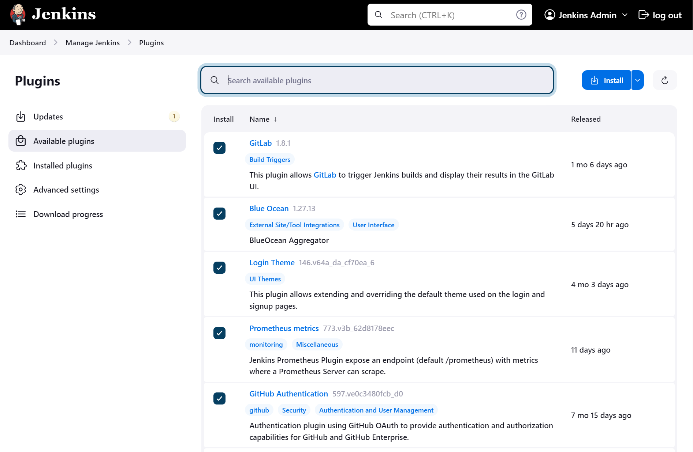
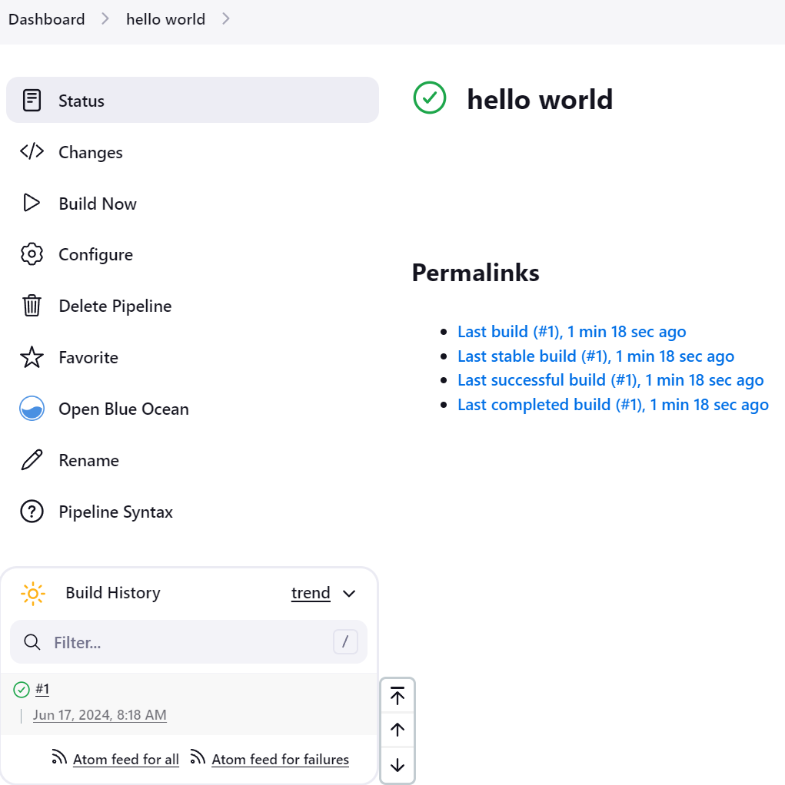

# Setting up Jenkins on Kubernetes using dockerdesktop

This guide provides step-by-step instructions for setting up Jenkins on Kubernetes using docker-desktop

## Prerequisites

Before you begin, ensure you have the following installed and configured:

- Docker (running on WSL for Windows users)
- kubectl
- helm
- wget

## Steps

### 1. Check Docker Installation

Ensure Docker is installed and running on WSL:

```bash
docker container ls
```

### 2. Checking cluster info

```bash
kubectl cluster-info 
```

### 3. Outputting the Kubernetes config file, to read data.

```bash
cat ~/.kube/config
```

### 4. Checking if nodes exist

```bash
kubectl get nodes
```

### 5. Adding the Jenkins chart repository

```bash
helm repo add jenkins https://charts.jenkins.io
helm repo update
```

### 6. Creating a new namespace named "jenkins"

```bash
kubectl create namespace jenkins
```

### 7. Set Jenkins namespace

```bash
kubectl config set-context --current --namespace=jenkins
```
check if its the right namespace

```bash
kubectl config view --minify | grep namespace:
```

### 8. Deploying a simple Jenkins instance

```bash
helm upgrade --install myjenkins jenkins/jenkins
```
Output should look like:

```bash
Release "myjenkins" does not exist. Installing it now.
NAME: myjenkins
LAST DEPLOYED: Mon Jun 17 10:57:13 2024
NAMESPACE: jenkins
STATUS: deployed
REVISION: 1
NOTES:
1. Get your 'admin' user password by running:
  kubectl exec --namespace jenkins -it svc/myjenkins -c jenkins -- /bin/cat /run/secrets/additional/chart-admin-password && echo
2. Get the Jenkins URL to visit by running these commands in the same shell:
  echo http://127.0.0.1:8080
  kubectl --namespace jenkins port-forward svc/myjenkins 8080:8080

3. Login with the password from step 1 and the username: admin
4. Configure security realm and authorization strategy
5. Use Jenkins Configuration as Code by specifying configScripts in your values.yaml file, see documentation: http://127.0.0.1:8080/configuration-as-code and examples: https://github.com/jenkinsci/configuration-as-code-plugin/tree/master/demos

For more information on running Jenkins on Kubernetes, visit:
https://cloud.google.com/solutions/jenkins-on-container-engine

For more information about Jenkins Configuration as Code, visit:
https://jenkins.io/projects/jcasc/
```

### 9. Output the password for the Jenkins admin user (it can take a few moments)

```bash
kubectl exec --namespace jenkins -it svc/myjenkins -c jenkins -- /bin/cat /run/secrets/additional/chart-admin-password && echo
```

### 10. To run Jenkins instance 
```bash
echo http://127.0.0.1:8080 && kubectl --namespace jenkins port-forward svc/myjenkins 8080:8080
```

### 11. Enter Jenkins server

type http://127.0.0.1:8080 in a browser and connect with the user 'admin' and the password that you recived on step 12

### 12. Installing plugins

In the Jenkins dashboard enter the "Manage Jenkins" section and then enter the "Plugins"
Search and Install the next plugins at the "Avaiable plugins" section

   

After the installation make sure that the next plugins are installed:

kubernetes (probably installed by default)
 
workflow-aggregator (probably installed by default)

git (probably installed by default)

configuration-as-code (probably installed by default)

gitlab-plugin

blueocean

workflow-multibranch

login-theme

prometheus

github-oauth 

docker* 

gitlab*

Pipeline Stage View

### 13. Running a pipeline for a test

1. Create new item on the Jenkins dashboard
2. Select the Pipeline option
3. Name it as "Hello-world
4. Scroll down and copy the next groovy code at the pipeline script

```bash
pipeline {
    agent any
    
    stages {
        stage('Hello') {
            steps {
                echo 'Hello, World!'
            }
        }
    }
    
    post {
        success {
            echo 'Pipeline succeeded! Hello, World!'
        }
        failure {
            echo 'Pipeline failed! Hello, World!'
        }
    }
}
```
5. Save it 
6. Click on "Build now"

You can check the status on the Console Output
If you succeed you'll see the green V and the build

   

## Troubleshooting

#### If you encounter port binding issues:

Check current processes on port 8080
```bash
sudo lsof -i :8080
```

If not needed, kill the process
```bash
sudo kill <PID>
```

#### if you encounter admin password issues

if the 'chart-admin-password' secret does not exist in your jenkins namespace you can run the next commands

```bash
kubectl get secret myjenkins -n jenkins -o jsonpath='{.data.jenkins-admin-password}' | base64 --decode
```

### Clean Jenkins Namespace


```bash
kubectl delete ns jenkins
```
