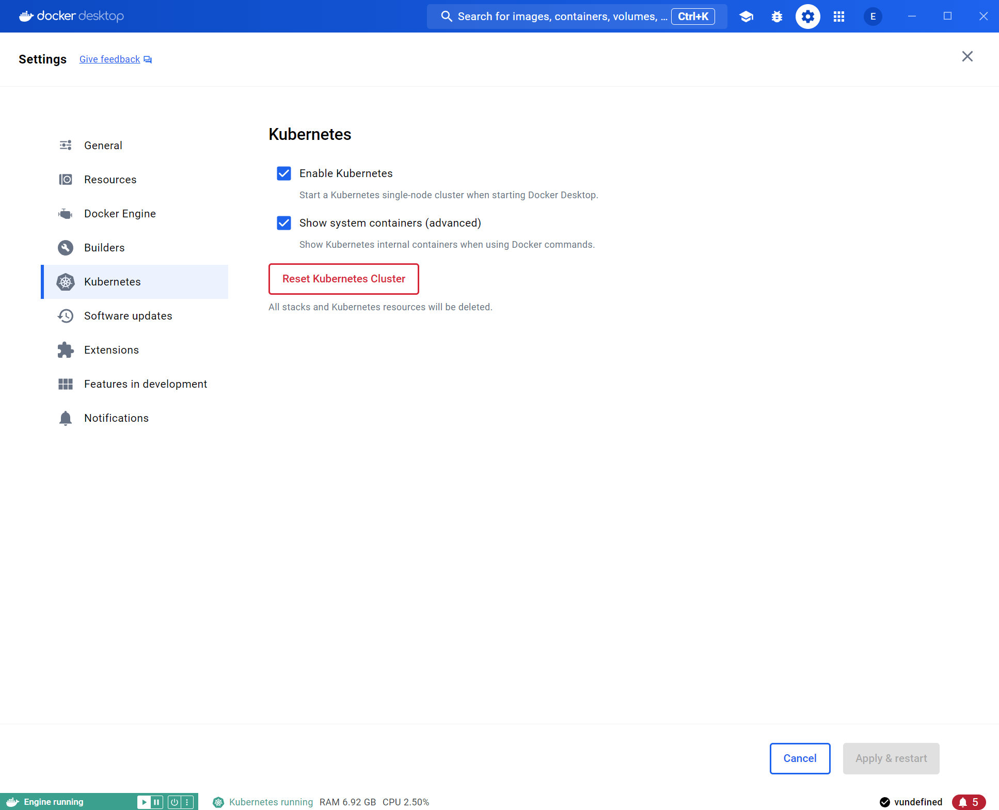

# Installing Docker Desktop and Kubernetes

This guide will walk you through the steps to install Docker Desktop and Kubernetes (K8s) on your machine.

## Prerequisites

- A compatible operating system (Windows 10 Pro/Enterprise/Education, macOS, or Linux).
- Administrative privileges on your machine to install software.
- A stable internet connection to download Docker Desktop.

## Steps

### 1. Install Docker Desktop

#### For Windows:

1. Download Docker Desktop for Windows from the official Docker website:
   [Docker Desktop Download](https://www.docker.com/products/docker-desktop)

2. Run the installer and follow the on-screen instructions to complete the installation.

3. After installation, Docker Desktop will launch automatically. If not, start Docker Desktop from your desktop or Start menu.

#### For macOS:

1. Download Docker Desktop for Mac from the official Docker website:
   [Docker Desktop Download](https://www.docker.com/products/docker-desktop)

2. Open the downloaded `.dmg` file and drag Docker to your Applications folder.

3. Open Docker from your Applications folder to start Docker Desktop.

#### For Linux:

1. Follow the instructions specific to your Linux distribution from the official Docker documentation:
   [Docker Desktop for Linux](https://docs.docker.com/desktop/linux/)

### 2. Enable Kubernetes in Docker Desktop

1. Once Docker Desktop is installed and running:

   - Open Docker Desktop.

   - Go to **Settings** > **Kubernetes**.

   - Check the box **Enable Kubernetes** and click **Apply & Restart**.

   - A screeshot from Docker Desktop with the box of **Enable Kubernetes** is checked

   

### 3. Verify Kubernetes Installation

1. Open a terminal or command prompt.

2. Check Kubernetes version:
   ```bash
   kubectl version
3. The output of the command should be similar to the next output:
   ```bash
   Client Version: v1.29.1
   Kustomize Version: v5.0.4-0.20230601165947-6ce0bf390ce3
   Server Version: v1.30.0
